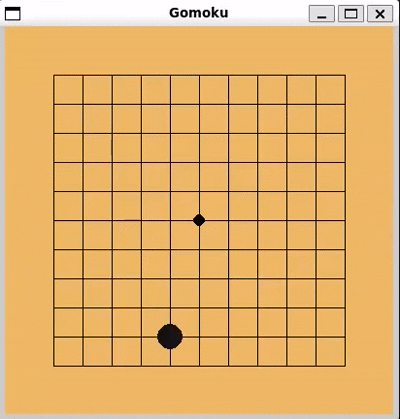
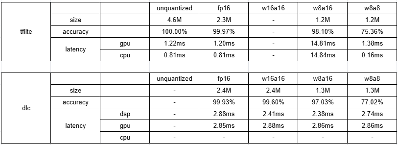
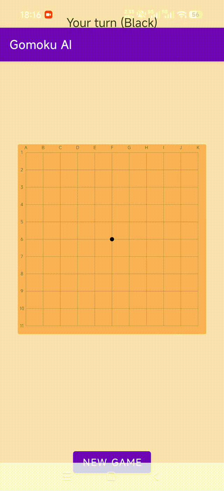

# Reinforcement-Learning-for-Gomoku
This project implements a **Proximal Policy Optimization (PPO)** agent that learns to play Gomoku through self-play. The training is distributed via [Ray](https://github.com/ray-project/ray), using an asynchronous architecture that decouples experience collection from model updates. A handcrafted **rule-based AI** is also included as both a baseline opponent and an evaluation benchmark.

The trained model can be **quantized and compiled** for on-device inference using Qualcomm's [AI Hub toolchain](https://aihub.qualcomm.com/get-started), [AI Model Efficiency Toolkit (AIMET)](https://quic.github.io/aimet-pages/releases/latest/index.html) and [AI Engine Direct SDK](https://www.qualcomm.com/developer/software/qualcomm-ai-engine-direct-sdk). Moreover, we provide a full **Android application** for playing against the AI.

## Requirements
To train the AI model from scratch, you may need:
- python=3.12
- torch=2.12.0+cu126
- ray=2.55.1
- numpy=2.4.6
- pygame=2.6.1

To quantize the torch model for Android deployment, you need:
- qai-hub=0.53.0
- aimet_onnx=2.35.1
- onnx=1.18.0
- onnxsim=0.7.0

And you may follow the instructions [here](https://docs.qualcomm.com/doc/80-63442-10/topic/linux_setup.html) to download and install the ``qairt`` toolkit, i.e., AI Engine Direct SDK.

## Getting Started
### 1. Training
To train the model from scratch:
```bash
cd training
python train.py
```
All checkpoints will be saved in ``training/checkpoints/``.

To play with the provided best model in ``training/best_model/``:
```bash
cd training
python play_with_ai.py
```
You can replace the best model with the one you obtain from training.

Here is an example game between RL-AI (black) and Rule-AI (white):


### 2. Quantization
We offer two Android-compatible model file formats: ``.tflite`` for deployment via TensorFlow Lite, and ``.dlc`` via Qualcomm Snapdragon Neural Processing Engine (SNPE). Below are the comparison results for different models, covering model size, accuracy, and average inference latency per step.


#### Convert to `.tflite`
To compile the torch model directly to ``.tflite``:
```bash
cd quantization
python convert_to_tflite.py
```
The output ``.tflite`` file will be saved to ``quantization/outputs_aihub/``.

#### Convert to `.dlc`
To convert the torch model to ``.dlc``, several steps need to be taken. First, run quantization simulation to evaluate the accuracy impact of different precision configurations:
```bash
cd quantization
python quantsim.py
```
This requires calibration data (``quantization/data/states.npy``), which can be collected during training. The output items of the simulation will be saved to ``quantization/outputs_quantsim/``.

After determining the optimal quantization precision, generate the final ``.dlc`` file using one of the following methods:
##### Option A: via AI Hub toolchain (cloud-based)
```bash
cd quantization
python quantize_aihub.py
```
The output ``.dlc`` file will be saved to ``quantization/outputs_aihub/``.

##### Option B: via AI Engine Direct SDK (local)
```bash
cd quantization
sh quantize_sdk.sh
```
The output ``.dlc`` file will be saved to ``quantization/outputs_sdk/``.

Note: Both methods use the quantized ONNX model and encodings produced by ``quantsim.py`` (located in ``quantization/outputs_quantsim/``).

### 3. Android Deployment
You can use Android Studio to build the ``android`` directory as a project. Once the build succeeds, you will obtain a runnable APK that can be installed on your Android device for inference validation. Note that the ``snpe-release.aar`` file in ``android/app/libs/`` comes from the qairt [zip file](https://apigwx-aws.qualcomm.com/qsc/public/v1/api/download/software/sdks/Qualcomm_AI_Runtime_Community/All/2.48.0.260626/v2.48.0.260626.zip), and you may replace the model files (``.tflite`` and ``.dlc``) in ``android/app/src/main/assets/`` with the ones you obtain in the previous steps.

Here is an example game between human player (black) and RL-AI (white):


